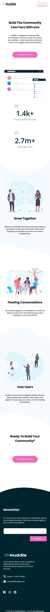
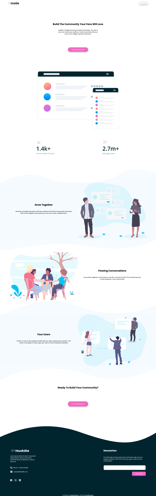

# Frontend Mentor - Huddle landing page with curved sections solution

This is a solution to the [Huddle landing page with curved sections challenge on Frontend Mentor](https://www.frontendmentor.io/challenges/huddle-landing-page-with-curved-sections-5ca5ecd01e82137ec91a50f2). Frontend Mentor challenges help you improve your coding skills by building realistic projects. 

## Table of contents

- [Overview](#overview)
  - [The challenge](#the-challenge)
  - [Screenshot](#screenshot)
  - [Links](#links)
- [My process](#my-process)
  - [Built with](#built-with)
  - [What I learned](#what-i-learned)
- [Author](#author)

## Overview

  - Construir un Huddle landing page with curved sections y hacer que se parezca lo más posible al diseño.

### The challenge

Users should be able to:

- View the optimal layout for the site depending on their device's screen size
- See hover states for all interactive elements on the page

### Screenshot

### Links

- Solution URL: [https://github.com/landrescobarl/Huddle-landing-page]
- Live Site URL: [https://lhuddle-landing-pagel.netlify.app]

## My process

### Built with

- Figma [https://www.figma.com/file/FzmeLsRYadgmxDCg9XeIE9/Untitled?node-id=0%3A1]
- Semantic HTML5 markup
- CSS custom properties
- Flexbox
- CSS Grid
- Mobile-first workflow

## Author

- Sitio web - [https://landrescobarl.github.io/] 
- Mentor de frontend - [@yourusername] (https://www.frontendmentor.io/profile/yourusername)
- Twitter - @IAndresEscobarI] 

